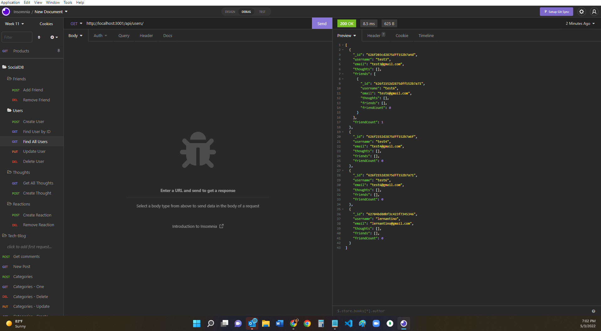

# social-network-API
API for a social network web application

## Description
This is a social network API web application where users can share their thoughts, react to friends’  
thoughts, and create a friend list. 

## Use
It is configured by using:  
Express.js  
MongoDB database  
Mongoose ODM  
The API routes have been tested using Insomnia.  

## Mockup
A video link to the file: 'https://drive.google.com/file/d/1sLdwHej4Tc7gPN_AuQpCg7QpXh6mBKBA/view'

## Contribution Guidelines
Your suggestions are welcome to help us create fully functional social-network API routes.

We use Github and all it's built-in features to host the website, and to pull requests to the local repository.

Report all bugs to Github <a href="https://github.com/issues" target="_blank">issues</a> 

This website uses semantic HTML elements, and universal, element, and class selectors in CSS.

# License
All submissions to this project will fall under <a href="https://choosealicense.com/licenses/mit/" target="_blank">issues</a>
